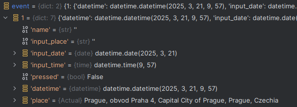

## Stávající stav




⎛⎝( ` ᢍ ´ )⎠⎞ᵐᵘʰᵃʰᵃ


### Vlastní python prostředí pro generaci 

- provádět v kořenovém adresáři
- tímhle se bude generovat dokumentace k funční vrstvě

```shell
python -m venv docenv
source docenv/bin/activate
pip-compile --upgrade --strip-extras docs/requirements.in
pip install -r docs/requirements.txt
```

- poslední krok je pak spustit ty soubory na generaci
- ještě to není plně hotové

```shell
python ./scripts/gen_mermaid.py  # vygenerovat diagramy

```

## Finální stav


```
module/
├── __init__.py
├── annotations.py        # (off) Media attachments 
├── config.py             # ✔️ Constants, defaults, paths
├── interface.py          # (off) JSON/CLI-facing command handlers
├── models.py             # ✔️ All domain data classes & enums
├── services.py           # ⏳ All computation logic (chart gen, aspects, transits)
├── utils.py              # ✔️ Current context.py (place and time utils)
└── workspace.py          # ⏳ Workspace I/O: loader, saver, structure
```

